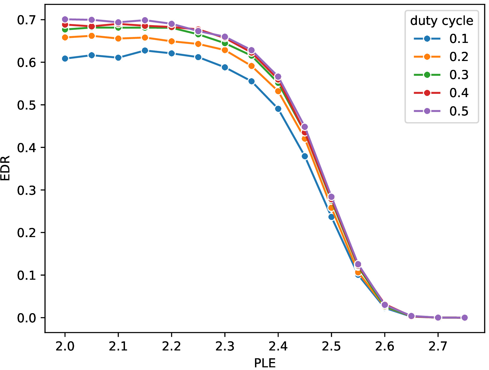
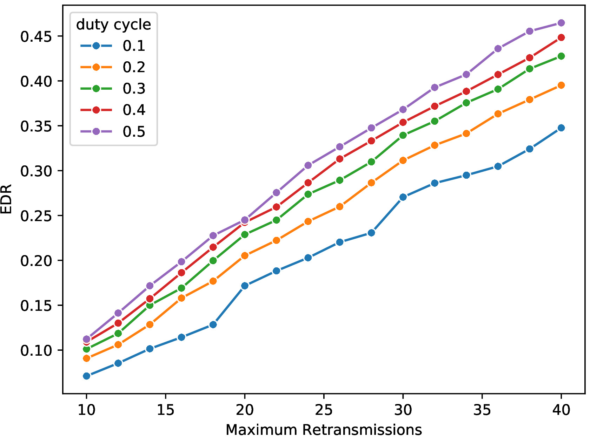
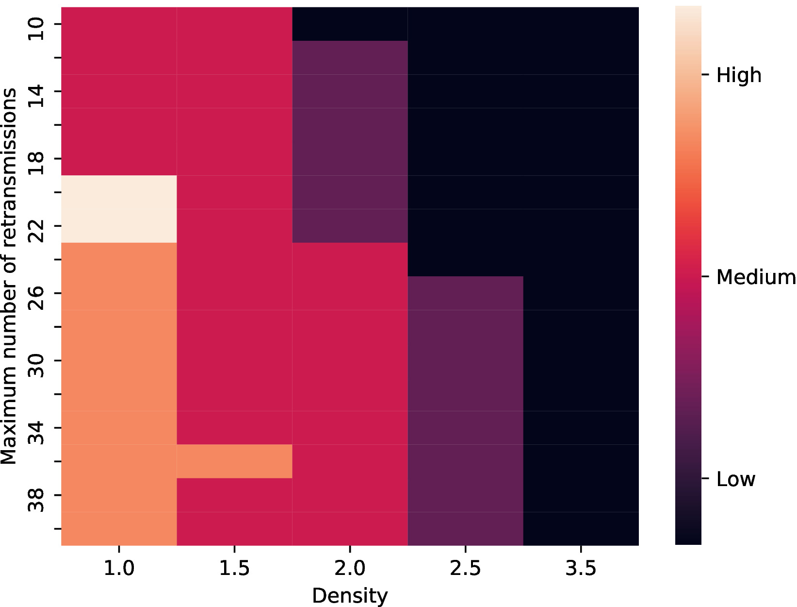

# Work in Progress

# An Open Source Simulator for the integration of 5G Narrowband Internet of Things and Device-to-Device Communication

_IoT aims to provide communication support to an ever-increasing number of devices. Narrowband IoT (NB-IoT) emerged as part of 5G technology focused on sensors and devices deployed almost anywhere. This technology is constantly challenged to improve its coverage, number of connected devices and minimize devices’s battery use. One strategy to extend the NB-IoT’s range is using device-to-device (D2D) communications. 
We present an open source simulation code for modeling NB-IoT/D2D hybrid communication systems. 
The simulations consider key parameters in cellular and D2D communications, such as D2D interference, transmission power, duty-cycle, device density, path attenuation, and the number of retransmissions. 
Besides, the expected delivery ratio (EDR) and expected end-to-end delay (EED) are used to compare the performance of each study scenario.
The code was developed for a GNU/Linux system. It was written in C, the compilation is assisted by Makefile, and the experiment setup script was written in BASH.
We expect to shed light on the future designs of NB-IoT infrastructure and its integration with D2D._

<p align="center">



</p>

If you like this simulator, please consider starring [link]( "https://github.com/LICAR-UBA/NBIoT-D2D-Sim") and spreading the word!


# Features

The simulator provides the following features:

- It is an in-silico lab, it provides an NB-IoT simulation model integrated with D2D capabilities. 
- It models crucial variables in cellular and D2D communications, including:
    - D2D interference, transmission power, duty dycle, retransmissions, path loss attenuation, user equipment density, footprint radius, packet size and transfer block size,   
- It runs in parallel in your notebook or in a computer cluster, using shared memory.
- Is OpenSource Software! 
   
  
# Installation instructions

To install simulator in GNU/Linux follow the next steps:

1. Install GCC (GNU Compiler Collection), version 7.4.0+
    - Note: to install in Ubuntu 18.04+, type in the console ```sudo apt-get update``` and then ```sudo apt-get install build-essential```
2. Download simulator code from [here](https://github.com/LICAR-UBA/NBIoT-D2D-Sim/archive/master.zip "NBIoT-D2D-Sim code"), and uncompress the zip file.


# How to setup and run your experiment

1. **NBIoT-D2D-Sim** can be adapted to your specific in-silico experiment by modifiyng the configuration file ```src/parameters.h```.
  
2. After modifying the configuration file (```src/parameters.h```), compilation and execution can be done effortlessly typing in the linux terminal: ```./run.sh```. The complete set of options of the bash script are described in the following section. The script will create a directory named ```simulation-1``` with three subdirectories in it: ```bin```, ```data``` and ```src```, which stores the simulation executable file, the output data and the source code of this particular simulation, respectively. Next time the script is executed the simulation directory will be named with the following natural number with regard to the last simulation, i.e. ```simulation-2```.
  
3. In ```simulation-1/data/``` folder you will find the output files (depending on the selected configuration in ```src/parameters.h```).


# Licence

GNU GPL v3.


# Acknowledgments

The authors would like to thank Consejo Nacional de Investigaciones Científicas y Técnicas (CONICET) and Universidad de Buenos Aires (UBA), Argentina.
  
  
